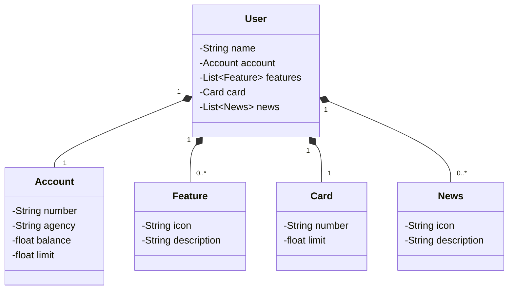

Java RESTful API

## Diagrama de Classes

```mermaid
classDiagram
    class User {
        -String name
        -Account account
        -List~Feature~ features
        -Card card
        -List~News~ news
    }
    
    class Account {
        -String number
        -String agency
        -float balance
        -float limit
    }
    
    class Feature {
        -String icon
        -String description
    }
    
    class Card {
        -String number
        -float limit
    }
    
    class News {
        -String icon
        -String description
    }
    
    User "1" *-- "1" Account
    User "1" *-- "0..*" Feature
    User "1" *-- "1" Card
    User "1" *-- "0..*" News
```
